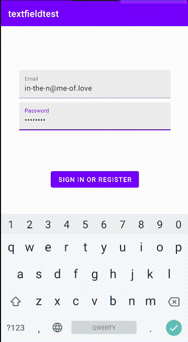
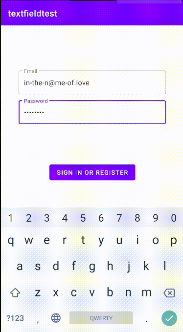

# TL;DR

`com.google.android.material.textfield.TextInputLayout`に`style="@style/Widget.Design.TextInputLayout"`を指定すれば🙆‍♂️

# 詳しい解説
### Design Support Library時代のText field

みなさんは、2014年のMaterial Design発表当時のText fieldのスタイルをまだ覚えているでしょうか？


`android.support.design.widget.TextInputLayout`を使い、Text fieldを実装していた頃のスタイルです。懐かしい！

因みにこのスタイルのText fieldですが、`com.google.android.material.textfield.TextInputLayout`に置き換わった現在でも`AppTheme`に`Theme.AppCompat.XXX`を継承させることで利用が可能です。

### Material Components時代のText field

2018年、Material Themingの発表により、Text fieldのスタイルは大きな変化を遂げました。




スタイルがFilledBoxとOutlinedBoxの2種類に分かれ、見た目も挙動も大きく変わりました。スタイルの切り替えは、`com.google.android.material.textfield.TextInputLayout`のstyleに`@style/Widget.MaterialComponents.TextInputLayout.FilledBox (or OutlinedBox)`を指定するだけでOKです。簡単ですね！

### 以前のスタイルのText fieldを`Theme.MaterialComponents`下で使いたい…

しかし問題点が。アプリ全体をMaterial Componentsに対応させるため、`AppTheme`の継承元を`Theme.MaterialComponents.XXX`に変えると、**全てのText fieldがFilledBoxに置き換わってしまいます**😱 `AppTheme`の変更は、アプリ全体に多大な影響を及ぼす、かなり破壊的な修正です。アプリの各画面のUIコンポーネントが全く別の見た目に変わってしまう事態は、できる限り回避すべきでしょう。

ではどうすれば、`Theme.MaterialComponents.XXX`下で以前のText fieldのスタイルを適用できるのか。答えは簡単、`com.google.android.material.textfield.TextInputLayout`に`style="@style/Widget.Design.TextInputLayout"`を指定するだけです！

```xml
<com.google.android.material.textfield.TextInputLayout
    android:id="@+id/text_input_layout"
    style="@style/Widget.Design.TextInputLayout"
    android:layout_width="0dp"
    android:layout_height="wrap_content"
    app:layout_constraintEnd_toEndOf="parent"
    app:layout_constraintStart_toStartOf="parent">
    <com.google.android.material.textfield.TextInputEditText
      android:id="@+id/text"
      ...
    />
</com.google.android.material.textfield.TextInputLayout>    
```

`@style/Widget.Design.TextInputLayout`を駆使することで、`AppTheme`の継承元を`AppTheme.MaterialComponents.XXX`に修正→Text fieldをモダンな見た目に修正、のように古いアプリのMaterial Components対応を段階的に進めることができます！めでたしめでたし😊

# おわりに

業務で見ているアプリのMaterial Components対応をしていた時にハマった問題でした。Material Designのガイドラインには`@style/Widget.Design.TextInputLayout`の記述が一切なかったため、当初はFilledBoxなText filedの色やmarginをいじり頑張って元のスタイルを再現しようとして発狂しました😇

Material Components対応で同じ問題に当たる人はそこそこいるはず…と思ったので、10ヶ月ぶりの更新サクッとやりました。参考になれば幸いです🙏

# 参考文献

- [[TextInputLayout] TextInputLayout legacy design · Issue #686 · material-components/material-components-android]
(https://github.com/material-components/material-components-android/issues/686)